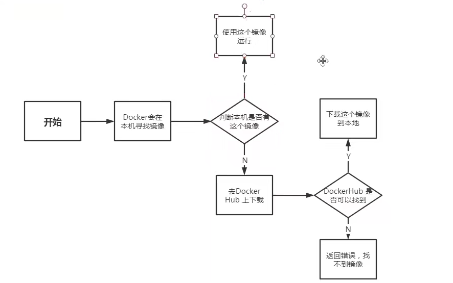
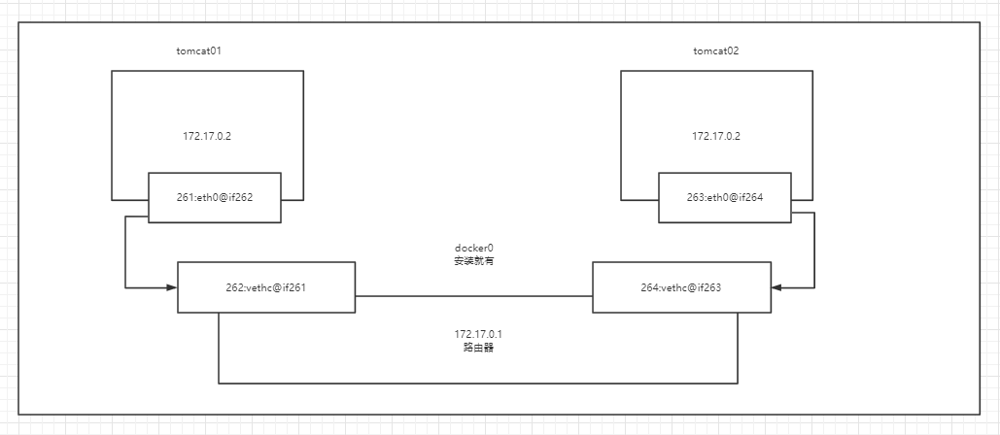
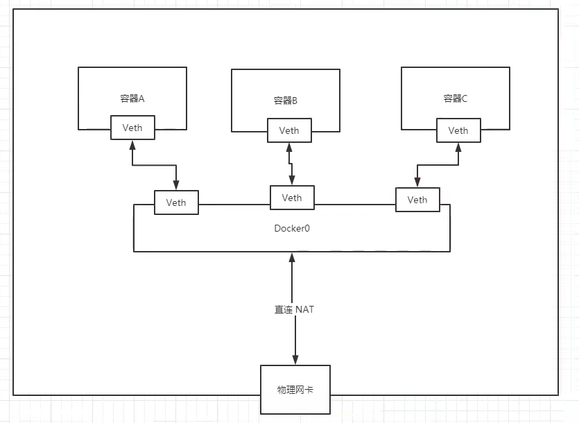

# docker
### 1. 概述
1. 轻量级
2. DevOps
### 2. 组成
1. 镜像：模板，创建多个容器
2. 容器：运行应用
3. 仓库：存放镜像
### 3. 安装相关
1. `/var/lib/docker docker默认工作路径`
### 4. 执行流程
1. 
2. 工作路程
   1. docker是一个clinet-server结构的系统，docker守护进程运行在主机上，通过socket从客户端访问
### 5.镜像
#### 联合文件系统
UnionFS 文件系统为一层层
bootfs: 镜像共享
rootfs: 
分层: 一个镜像包含很多层，

1. `docker images` 查询本地镜像
2. `docker search` 查询镜像
3. `docker pull` 下载镜像 联合镜像，可使用其他镜像的底层
4. `docker rmi `
### 6. 容器操作
#### 基础命令
1. `docker run` 启动容器 
   1. --name 容器名称
   2. -d 后台,
   3. -it 交互模式
   4. -p 端口
   5. -e 环境配置
2. `docker ps` 查看启动容器信息
3. `docker rm` 删除容器
4. `docker start/restart/stop/kill`
5. `docker logs` 查看容器启动日志，排查启动失败异常
6. `docker top` 查看容器内分服务
7. `docker inspect` 查看容器信息
8. `docker stat` 查看容器信息
9. `docker exec ` 进入容器
10. `docker cp` 从容器中拷出文件（可拷贝停止的）
### 6.1 可视化
portainer
rench
### 7. 容器数据卷
作用：容器的数据需要持久化，容器之间数据共享  

`docker volume`  

1.命令创建`docker run -v 主机目录:容器内目录:ro(rw)`     
   例：创建mysql `docker run -d -p 3306:3306 -v /home/mysql/conf:/etc/mysql/conf.d -v /home/mysql/data:/var/lib/mysql -e MYSQL_ROOT_PASSWORD=123456 mysql`
- 指定路径 `-v /宿主机路径:容器内路径:ro(rw)` ro/rw 只读/读写 
- 具名挂载 `-v 名称:容器内路径` 通过`docker volume ls`查看 `名称`
- 匿名挂载 `-v 容器内路径`  通过`docker volume ls`查看 `随机名称`
- 所有没有指定主机目录的卷配置，都在宿主机的 `/var/lib/docker/volumns/xxx/_data`
- 容器卷共享 `--volumes-from 父容器` 拷贝不是共享，一个容器删除数据后不会影响其他容器的数据
  - `docker run -d -p 3301:3306 -v /etc/mysql/conf.d -v /var/lib/mysql -e MYSQL_ROOT_PASSWORD=123456 --name mysql01 mysql:5.7`
  - `docker run -d -p 3302:3306 -e MYSQL_ROOT_PASSWORD=123456 --name mysql02 --volumes-from mysql01 mysql:5.7`  
#### 总结：
  1. 容器之间配置信息的传递，数据卷容器的生命周期一直持续到没有容器使用为止
  2. 一旦持久到本地，本地的数据是不会删除的

### 8. 网络

### 7. 镜像构建 
#### 1. commit 构建
   1. ```shell
      #启动一个容器
      docker run --name webserver -d -p 80:80 nginx
      #修改当前容器
      docker exec -it webserver bash
      #构建
      docker commit \
      --author "marble" \
      --message "修改了默认网页" \
      webserver \
      nginx:v2
      #通过新镜像启动
      docker run --name webserver -d -p 81:80 nginx:v2
      ```
      **注意**：
      - 不要通过commit构建
      - 黑箱镜像
#### 2. Dockerfile 构建
##### 基础
1. 文件中命令全部大写
2. Dockerfile: 构建文件，定义一切的步骤，源代码
3. 文本文件包含了一条条指令，每一条指令构建一层
4. 大多数的镜像都是`FROM scratch`
##### 构建
   1. 编写Dockerfile
      ```dockerfile
      FROM nginx
      RUN echo '<h1>Hello, Docker!</h1>' > /usr/share/nginx/html/index.html
      CMD /bin/bash
      ```
      ```dockerfile
      FROM              #指定基础镜像
      MAINTAINER        #维护者 姓名+邮箱
      RUN               #镜像构建的时候需要运行的命令
      WORKDIR           #工作目录，容器启动进入的
      VOLUME            #挂载的目录
      COPY              #复制上下文目录下的目标文件到镜像中（推荐使用，透明）
      ADD               #复制上下文目录下的目标文件到镜像中(ADD 的最佳用例是将本地 tar 文件自动提取到镜像中)
      EXPOSE            #暴露端口
      CMD               #容器启动时要执行的命令,只有最后一个会生效(CMD [ls] [-a]) 
      ENTRYPOINT        #最佳用处是设置镜像的主命令
      ONBUILD           #当构建一个被继承DockerFile 触发指令
      ENV               #构建的时候设置环境变量
      ```  
      CMD
      1. shell 格式：CMD <命令>  
         1. 命令会被包装为 sh -c 的参数的形式进行执行  
      2. exec 格式：CMD ["可执行文件", "参数1", "参数2"...]  
      
      ENTRYPOINT  
      1. 当指定了 ENTRYPOINT 后，CMD 的含义就发生了改变，不再是直接的运行其命令，而是将 CMD 的内容作为参数传给 ENTRYPOINT 指令
   2. 构建镜像
      ```shell
      #docker build [选项] <上下文路径/URL/->
      docker build -f mydockerfile -t nginx:v3 .
      ```
      - -f Dockerfile文件名 
      - 镜像构建上下文：命令最后的.表示上下文路径，build命令并非在本地构建，而是在服务端。执行命令时会将该上下文路径下的所有文件打包上传到Docker引擎。
   3. 查看构建历史 `docker history`
   4. 运行 `docker run`
   5. 推送 `docker push`
例：tomcat压缩包，jdk压缩包
```dockerfile
FROM centos
MAINTAINER marble<123@qq.com>
COPY readme.txt /usr/local/readme.txt
ADD jdk.tar.gz /usr/local
ADD tomcat.tar.gz /usr/local
RUN yum -y install vim
ENV MYPATH /usr/local
WORKDIR $MYPATH
ENV JAVA_HOME /usr/local/jdk1.8
EXPOSE 8080
CMD /usr/local/tomcat/bin/startup.sh && tail -f /usr/local/tomcat/logs/cataliner.out
```
### 9.网络
#### link
容器和容器是可以互相ping通的

docker使用桥接技术

docker所有的网络接口都是虚拟的
`--link 容器名` hosts文件里直接写入，反向ping不通（废弃）
docker0不支持容器名连接访问
#### 自定义网络

##### 网络模式
1.bridge：桥接 docker(默认)
2.none: 不配置网络
3.host: 和宿主机共享网络
4.container：容器网络连通  
命令  
`docker network ls` 查看所有网络
```shell
docker run --net bridge #默认
#创建网络
docker network create --driver bridge --sub 192.168.0.0/16 --gateway 192.168.0.1 mynet
docker run --net mynet #
```
好处：集群健康  
网络联通（跨网络）
`docker network connect ` 把容器连接到一个网络上

springboot


